# Guía de Arquitectura: .NET Aspire — Proyecto MasterNet

## Tabla de Contenidos

1. [¿Qué es .NET Aspire en este sistema?](#1-qué-es-net-aspire-en-este-sistema)
2. [Estructura de proyectos](#2-estructura-de-proyectos)
3. [Configuración del entorno (Docker + WSL)](#3-configuración-del-entorno-docker--wsl)
4. [Instalación de plantillas de Aspire](#4-instalación-de-plantillas-de-aspire)
5. [Creando un proyecto Aspire](#5-creando-un-proyecto-aspire)
6. [Configurando Docker con SQL Server](#6-configurando-docker-con-sql-server)
7. [Configuración del AppHost](#7-configuración-del-apphost)
8. [ServiceDefaults: configuración centralizada](#8-servicedefaults-configuración-centralizada)
9. [AppHost como orquestador de servicios (SQL + Redis)](#9-apphost-como-orquestador-de-servicios-sql--redis)
10. [MigrationService: migraciones con Entity Framework](#10-migrationservice-migraciones-con-entity-framework)
11. [MigrationSQLService: migraciones con scripts SQL](#11-migrationsqlservice-migraciones-con-scripts-sql)
12. [Service Discovery](#12-service-discovery)
13. [Bindings en .NET Aspire](#13-bindings-en-net-aspire)
14. [Parámetros y cadenas de conexión](#14-parámetros-y-cadenas-de-conexión)
15. [Redis y Web APIs con Aspire](#15-redis-y-web-apis-con-aspire)
16. [OpenTelemetry: Observabilidad](#16-opentelemetry-observabilidad)
17. [Health Checks](#17-health-checks)

---

## 1. ¿Qué es .NET Aspire en este sistema?

.NET Aspire no es únicamente un framework: es el **orquestador central** de la solución. En lugar de tener servicios distribuidos sin coordinación, Aspire crea una "malla" que envuelve la base de datos (SQL Server), el motor de caché (Redis) y las APIs, gestionando sus dependencias de forma declarativa.

**Beneficio clave:** Si un servicio falla, el orquestador lo detecta y lo reinicia automáticamente. Es ideal para entornos que requieren alta disponibilidad.

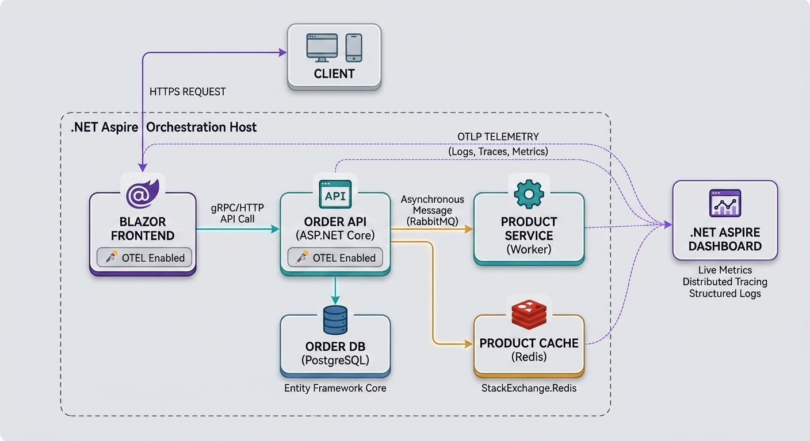

---

## 2. Estructura de proyectos

La solución `MasterNet` está organizada de forma que cada proyecto tiene una responsabilidad concreta y bien delimitada:

```
aspire/
└── src/
    ├── MasterNet.AppHost/           → Orquestador principal (define quién se conecta con quién)
    ├── MasterNet.ServiceDefaults/   → Configuración centralizada: logs, métricas, seguridad
    ├── MasterNet.WebApi/            → API REST principal
    ├── MasterNet.Client/            → Frontend (Blazor / cliente web)
    ├── MasterNet.Application/       → Lógica de negocio (CQRS + MediatR)
    ├── MasterNet.Domain/            → Entidades del dominio
    ├── MasterNet.Persistence/       → DbContext y acceso a datos
    ├── MasterNet.Infrastructure/    → Servicios externos e integraciones
    ├── MasterNet.MigrationService/  → Migraciones EF Core con seed de datos
    ├── MasterNet.MigrationSQLService/ → Migraciones mediante scripts SQL puros
    └── MasterNet.RatingService/     → Microservicio de calificaciones con Redis
```

| Proyecto | Rol |
|---|---|
| **AppHost** | Director de orquesta: registra y conecta todos los servicios |
| **ServiceDefaults** | Estándar transversal: telemetría, logs, health checks y Service Discovery |
| **MigrationService** | Asegura que la BD exista, esté migrada y tenga datos antes de iniciar |
| **RatingService** | Microservicio independiente que gestiona calificaciones en Redis |

---

## 3. Configuración del entorno (Docker + WSL)

### 3.1. Verificar virtualización en Windows

Antes de instalar Docker Desktop, confirma que la virtualización esté habilitada en el sistema operativo:

```powershell
systeminfo | findstr /i "virtualization"
```

### 3.2. Instalar WSL (requerido por Docker)

```powershell
wsl --install
```

Reinicia el equipo después de la instalación.

### 3.3. Instalar .NET Aspire CLI

```powershell
irm https://aspire.dev/install.ps1 | iex

# Verificar la instalación
aspire --version

# Crear y ubicarse en el directorio de trabajo
mkdir c:/aspire-dev
cd c:/aspire-dev
```

### 3.4. Verificar versión de .NET SDK

```powershell
# Versión activa
dotnet --version

# Listar todos los SDK instalados
dotnet --list-sdks
```

Ejemplo de salida:
```
2.1.202 [C:\Program Files\dotnet\sdk]
3.1.426 [C:\Program Files\dotnet\sdk]
7.0.410 [C:\Program Files\dotnet\sdk]
9.0.102 [C:\Program Files\dotnet\sdk]
10.0.201 [C:\Program Files\dotnet\sdk]
```

> .NET Aspire requiere SDK 9.0 como mínimo. Este proyecto usa **SDK 10.0.201**.

### 3.5. Fijar versión del SDK (archivo ancla)

Para garantizar que todos los desarrolladores usen la misma versión, se crea un `global.json` en la raíz del proyecto:

```powershell
dotnet new globaljson --sdk-version 10.0.201
```

Esto genera el archivo `global.json`:

```json
{
  "sdk": {
    "version": "10.0.201"
  }
}
```

---

## 4. Instalación de plantillas de Aspire

Las plantillas de Aspire se descargan desde NuGet:

```powershell
# Instalar las plantillas
dotnet new install Aspire.ProjectTemplates

# Verificar las plantillas disponibles
dotnet new list 'aspire'
```

---

## 5. Creando un proyecto Aspire

Sitúate en la carpeta donde quieras crear el proyecto y ejecuta:

```powershell
dotnet new aspire-starter -n MyAspireApp

# Ejecutar el proyecto (siempre desde el AppHost)
dotnet run --project MyAspireApp.AppHost
```

El dashboard de Aspire estará disponible en una URL similar a:
```
https://localhost:17120/login?t=<token>
```

> El token de acceso se genera en cada ejecución y se muestra en la salida de la consola.

---

## 6. Configurando Docker con SQL Server

### 6.1. Archivo `docker-compose.yml`

El siguiente archivo define dos servicios: el servidor SQL y un contenedor de inicialización (`database-seed`) que depende de que el primero esté completamente operativo.

```yaml
# docker-compose.yml
services:
  database:
    image: mcr.microsoft.com/mssql/server:2022-latest
    container_name: database
    environment:
      - ACCEPT_EULA=Y
      - MSSQL_SA_PASSWORD=Vaxi$$2025USPass   # $$ es el escape para $ en YAML
    ports:
      - "1433:1433"
    healthcheck:
      test: ["CMD-SHELL", "/opt/mssql-tools18/bin/sqlcmd -C -S localhost -U sa -P 'Vaxi$$2025USPass' -Q 'SELECT 1' || exit 1"]
      interval: 10s
      timeout: 5s
      retries: 5
      start_period: 30s
    networks:
      - masternet-network

  database-seed:
    depends_on:
      database:
        condition: service_healthy    # Solo inicia cuando database pasa el healthcheck
    build:
      context: ./Database
      dockerfile: Dockerfile
    container_name: database-seed
    environment:
      - SA_PASSWORD=Vaxi$$2025USPass
      - DB_SERVER=database
    networks:
      - masternet-network

networks:
  masternet-network:
    driver: bridge
```

### 6.2. Levantar los contenedores

Ejecuta el siguiente comando desde el directorio donde está el `docker-compose.yml`:

```powershell
docker compose up -d
```

### 6.3. Solución de problemas al iniciar Docker

Si Docker no levanta correctamente los servicios de red, reinicia el servicio WinNAT:

```powershell
net stop winnat
# Vuelve a intentar levantar el proyecto
net start winnat
```

### 6.4. Corregir certificados HTTPS locales

Si encuentras errores de SSL en el entorno de desarrollo:

```powershell
# Eliminar certificados existentes
dotnet dev-certs https --clean

# Crear y confiar en nuevos certificados
dotnet dev-certs https --trust
```

---

## 7. Configuración del AppHost

El `AppHost` es el punto de entrada de la orquestación. Se crea con la plantilla específica de Aspire:

```powershell
dotnet new aspire-apphost -n MasterNet.AppHost -o .\src\MasterNet.AppHost
dotnet sln add .\src\MasterNet.AppHost
```

### Estructura base de `AppHost.cs`

```csharp
var builder = DistributedApplication.CreateBuilder(args);

// Registramos el API como recurso
var api = builder.AddProject<Projects.MasterNet_WebApi>("api");

// El cliente espera a que el API esté listo antes de iniciarse
builder.AddProject<Projects.MasterNet_Client>("client")
    .WithReference(api)           // Inyecta la referencia al API
    .WaitFor(api)                 // El cliente espera a que el API levante
    .WithExternalHttpEndpoints(); // Expone el endpoint HTTP fuera de Aspire

builder.Build().Run();
```

> Una vez configurado el `AppHost`, **es el único proyecto que se ejecuta** para iniciar toda la solución.

---

## 8. ServiceDefaults: configuración centralizada

`MasterNet.ServiceDefaults` centraliza la configuración transversal de todos los servicios: telemetría, logs, health checks y Service Discovery. Cada proyecto de la solución lo referencia.

```powershell
dotnet new aspire-servicedefaults -n MasterNet.ServiceDefaults -o .\src\MasterNet.ServiceDefaults
dotnet sln add .\src\MasterNet.ServiceDefaults
```

El archivo principal `Extensions.cs` registra:

- **OpenTelemetry** (logs, métricas, trazas)
- **Health checks** (`/health` y `/alive`)
- **Service Discovery** para resolución de nombres internos
- **Resiliencia HTTP** con `AddStandardResilienceHandler`

Cada servicio de la solución invoca `builder.AddServiceDefaults()` en su `Program.cs` para heredar toda esta configuración automáticamente.

---

## 9. AppHost como orquestador de servicios (SQL + Redis)

Con Aspire como orquestador, **no es necesario mantener un `docker-compose.yml` separado** para SQL Server ni Redis. El `AppHost` gestiona sus ciclos de vida directamente.

### Paquetes necesarios en `MasterNet.AppHost`

```powershell
cd .\src\MasterNet.AppHost\

# Para SQL Server
dotnet add package Aspire.Hosting.SqlServer --version 13.1.2

# Para Redis
dotnet add package Aspire.Hosting.Redis --version 13.1.2
```

### `AppHost.cs` completo (configuración actual del proyecto)

```csharp
using Projects;

var builder = DistributedApplication.CreateBuilder(args);

// Parámetros: se leen de appsettings.json > Parameters
// secret: true evita que aparezca en logs
var password = builder.AddParameter("password", secret: true);
var myParameter = builder.AddParameter("myParameter");
var myConnectionString = builder.AddConnectionString("myConnectionString");

// SQL Server (contenedor persistente)
var server = builder.AddSqlServer("server", password, 1433)
    .WithLifetime(ContainerLifetime.Persistent);

var db = server.AddDatabase("MasterNetDB");

// Redis (contenedor persistente con interfaz visual)
var cache = builder.AddRedis("cache")
    .WithRedisCommander()               // Panel visual de Redis en desarrollo
    .WithLifetime(ContainerLifetime.Persistent);

// Microservicio de calificaciones (depende de Redis)
var ratingService = builder.AddProject<MasterNet_RatingService>("ratingservice")
    .WithReference(cache)
    .WaitFor(cache);

// API principal (depende de SQL y del servicio de ratings)
var api = builder.AddProject<Projects.MasterNet_WebApi>("api")
    .WithHttpEndpoint(port: 5001)
    .WithReference(db)
    .WithReference(ratingService)
    .WaitFor(db)
    .WaitFor(ratingService);

// Cliente web (depende del API)
builder.AddProject<Projects.MasterNet_Client>("client")
    .WithReference(api)
    .WaitFor(api)
    .WithExternalHttpEndpoints();

// Servicio de migración SQL (depende de la BD)
builder.AddProject<MasterNet_MigrationSQLService>("migrationSQL")
    .WithReference(db)
    .WaitFor(db)
    .WithParentRelationship(server);

builder.Build().Run();
```

> El `appsettings.json` del `AppHost` debe contener la sección `Parameters` con los valores sensibles:
>
> ```json
> "Parameters": {
>   "password": "Vaxi$$2025USPass",
>   "myParameter": "valor-de-ejemplo"
> }
> ```

---

## 10. MigrationService: migraciones con Entity Framework

Este servicio es una aplicación de consola que se ejecuta en segundo plano al iniciar la solución. Su responsabilidad es garantizar que la base de datos exista, esté actualizada y contenga los datos iniciales.

```powershell
dotnet new console -n MasterNet.MigrationService -o .\src\MasterNet.MigrationService
dotnet sln add .\src\MasterNet.MigrationService

# Dependencias
dotnet add package Aspire.Microsoft.EntityFrameworkCore.SqlServer --version 13.1.2
dotnet add package Microsoft.EntityFrameworkCore.SqlServer --version 10.0.3
```

### `Program.cs`

```csharp
using MasterNet.MigrationService;
using MasterNet.Persistence;

var builder = Host.CreateApplicationBuilder(args);

builder.Services.AddHostedService<Worker>();
builder.AddServiceDefaults();
builder.AddSqlServerDbContext<MasterNetDbContext>(connectionName: "MasterNetDB");

var host = builder.Build();
host.Run();
```

### `Worker.cs`

El `Worker` ejecuta tres pasos en orden:

1. **Crear la base de datos** si no existe
2. **Ejecutar las migraciones** pendientes de EF Core
3. **Insertar datos iniciales** (seed) si las tablas están vacías

```csharp
public class Worker(
    IServiceProvider serviceProvider,
    IHostApplicationLifetime hostApplicationLifetime) : BackgroundService
{
    public const string ActivitySourceName = "Migrations";
    private static readonly ActivitySource ActivitySource = new(ActivitySourceName);

    protected override async Task ExecuteAsync(CancellationToken stoppingToken)
    {
        using var activity = ActivitySource.StartActivity("Migrando DataBase", ActivityKind.Client);
        try
        {
            using var scope = serviceProvider.CreateScope();
            var context = scope.ServiceProvider.GetRequiredService<MasterNetDbContext>();

            await CrearBaseDatosAsync(context, stoppingToken);
            await EjecutarMigracionAsync(context, stoppingToken);
            await InsertarDataAsync(context, stoppingToken);
        }
        catch (Exception ex)
        {
            activity?.AddException(ex);
            throw;
        }
        hostApplicationLifetime.StopApplication();
    }

    private static async Task CrearBaseDatosAsync(MasterNetDbContext dbContext, CancellationToken cancellationToken)
    {
        var dbCreator = dbContext.GetService<IRelationalDatabaseCreator>();
        var strategy = dbContext.Database.CreateExecutionStrategy();
        await strategy.ExecuteAsync(async () =>
        {
            if (!await dbCreator.ExistsAsync(cancellationToken))
                await dbCreator.CreateAsync(cancellationToken);
        });
    }

    private static async Task EjecutarMigracionAsync(MasterNetDbContext dbContext, CancellationToken cancellationToken)
    {
        var strategy = dbContext.Database.CreateExecutionStrategy();
        await strategy.ExecuteAsync(async () =>
        {
            await using var transaction = await dbContext.Database.BeginTransactionAsync(cancellationToken);
            await dbContext.Database.MigrateAsync(cancellationToken);
            await transaction.CommitAsync(cancellationToken);
        });
    }

    private static async Task InsertarDataAsync(MasterNetDbContext context, CancellationToken cancellationToken)
    {
        if (await context.Courses!.AnyAsync(cancellationToken)) return;

        var strategy = context.Database.CreateExecutionStrategy();
        await strategy.ExecuteAsync(async () =>
        {
            await using var transaction = await context.Database.BeginTransactionAsync(cancellationToken);

            var instructors = new List<Instructor>
            {
                new() { Id = Guid.Parse("a1111111-1111-1111-1111-111111111111"), FirstName = "John", LastName = "Smith", Degree = "PhD in Computer Science" }
            };
            context.Instructors!.AddRange(instructors);
            await context.SaveChangesAsync(cancellationToken);

            var prices = new List<Price>
            {
                new() { Id = Guid.Parse("11111111-1111-1111-1111-111111111111"), Name = "Free", CurrentPrice = 0.00m, PromotionPrice = 0.00m }
            };
            context.Prices!.AddRange(prices);
            await context.SaveChangesAsync(cancellationToken);

            var courses = new List<Course>
            {
                new() { Id = Guid.Parse("c1111111-1111-1111-1111-111111111111"), Title = "ASP.NET Core Fundamentals", Description = "Learn the basics of ASP.NET Core web development", PublishedAt = new DateTime(2024, 1, 15) }
            };
            context.Courses!.AddRange(courses);
            await context.SaveChangesAsync(cancellationToken);

            await transaction.CommitAsync(cancellationToken);
        });
    }
}
```

### `AppHost.cs` con MigrationService integrado

```csharp
// 2. Migración (depende de la BD)
var migration = builder.AddProject<Projects.MasterNet_MigrationService>("migration")
    .WithReference(db)
    .WaitFor(db)
    .WithParentRelationship(server);

// 3. API (espera a que la migración finalice)
var api = builder.AddProject<Projects.MasterNet_WebApi>("api")
    .WithReference(db)
    .WaitFor(migration)
    .WithReference(migration);
```

---

## 11. MigrationSQLService: migraciones con scripts SQL

Esta es una alternativa al `MigrationService` basado en EF Core. En lugar de migraciones de código, ejecuta directamente un script `.sql`.

> **En el proyecto actual, este es el servicio de migración activo** (`migrationSQL` en el `AppHost`).

```powershell
dotnet new console -n MasterNet.MigrationSQLService -o .\src\MasterNet.MigrationSQLService
dotnet sln add .\src\MasterNet.MigrationSQLService

dotnet add package Microsoft.Data.SqlClient --version 6.1.4
```

### Vinculación del script SQL al proyecto

En el archivo `.csproj` se agrega una referencia al script externo. Esto lo copia al directorio de salida como un enlace simbólico:

```xml
<ItemGroup>
    <Content Include="..\..\Database\CreateDatabaseAndSeed.sql"
             CopyToOutputDirectory="PreserveNewest"
             Link="Script\CreateDatabaseAndSeed.sql" />
</ItemGroup>
```

### `Worker.cs` del MigrationSQLService

```csharp
public class Worker(
    IConfiguration configuration,
    IHostApplicationLifetime hostApplicationLifetime,
    ILogger<Worker> logger) : BackgroundService
{
    public const string ActivitySourceName = "SQLMigrations";
    private static readonly ActivitySource activitySource = new(ActivitySourceName);

    protected override async Task ExecuteAsync(CancellationToken stoppingToken)
    {
        using var activity = activitySource.StartActivity("Ejecutando SQL Scripts", ActivityKind.Client);
        try
        {
            var connectionString = configuration.GetConnectionString("MasterNetDB");
            if (string.IsNullOrEmpty(connectionString))
                throw new InvalidOperationException("No existe cadena de conexión");

            // Conectar a 'master' para poder crear la BD si no existe
            var builder = new SqlConnectionStringBuilder(connectionString)
            {
                InitialCatalog = "master",
            };

            var sqlFilePath = Path.Combine(AppContext.BaseDirectory, "Script", "CreateDatabaseAndSeed.sql");
            if (!File.Exists(sqlFilePath))
                throw new ArgumentException("No existe el archivo del script");

            logger.LogInformation("Cargando Script: {SqlFilePath}", sqlFilePath);
            var sqlScript = await File.ReadAllTextAsync(sqlFilePath, stoppingToken);

            // Dividir el script en lotes separados por GO
            var batches = Regex.Split(sqlScript, @"^\s*GO\s*$", RegexOptions.Multiline | RegexOptions.IgnoreCase);

            await using var connection = new SqlConnection(builder.ConnectionString);
            await connection.OpenAsync(stoppingToken);

            logger.LogInformation("Ejecutando {BatchCount} lotes", batches.Length);
            foreach (var batch in batches)
            {
                if (!string.IsNullOrWhiteSpace(batch))
                {
                    await using var command = new SqlCommand(batch, connection);
                    command.CommandTimeout = 60;
                    await command.ExecuteNonQueryAsync();
                }
            }
            logger.LogInformation("Script ejecutado con éxito.");
        }
        catch (Exception ex)
        {
            logger.LogError(ex, "Error crítico ejecutando SQL scripts");
            activity?.SetStatus(ActivityStatusCode.Error);
            activity?.AddException(ex);
            throw;
        }
        finally
        {
            hostApplicationLifetime.StopApplication();
        }
    }
}
```

---

## 12. Service Discovery

Service Discovery permite que los servicios se comuniquen entre sí **por nombre** en lugar de por IP o puerto fijo. Esto evita problemas cuando los puertos cambian o están ocupados en el entorno local.

- En lugar de `http://localhost:5001`, se usa `https+http://ratingservice`
- El nombre (`ratingservice`) coincide con el alias registrado en `AppHost.cs`
- La resolución la hace automáticamente el middleware configurado en `ServiceDefaults`

La línea clave en `MasterNet.ServiceDefaults/Extensions.cs`:

```csharp
builder.Services.AddServiceDiscovery();
// ...
http.AddServiceDiscovery(); // dentro de ConfigureHttpClientDefaults
```

### Crear un endpoint con alias personalizado

```csharp
var api = builder.AddProject<Projects.MasterNet_WebApi>("api")
    .WithReference(db)
    .WaitFor(migration)
    .WithHttpEndpoint(name: "api-base") // alias personalizado
    .WithReference(migration);
```

---

## 13. Bindings en .NET Aspire

Los bindings definen **cómo se expone un servicio a la red**: protocolo, puerto y nombre del endpoint.

### Implicit Binding

Aspire detecta automáticamente los puertos HTTP/HTTPS definidos en `launchSettings.json` y los registra sin intervención manual.

>  Diagrama de binding implícito

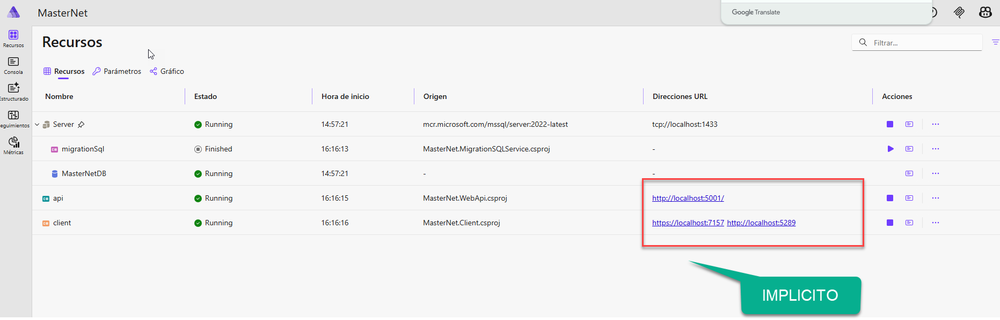

### Explicit Binding

Se configura manualmente cuando necesitas control total sobre el puerto o el nombre del endpoint:

```csharp
var api = builder.AddProject<Projects.MasterNet_WebApi>("api")
    .WithReference(db)
    .WaitFor(migration)
    .WithHttpEndpoint(port: 3000) // puerto explícito
    .WithReference(migration);
```

Cuando se usa binding explícito, se recomienda eliminar la `applicationUrl` del perfil en `launchSettings.json`:

```json
"http": {
  "commandName": "Project",
  "dotnetRunMessages": true,
  "launchBrowser": true,
  "environmentVariables": {
    "ASPNETCORE_ENVIRONMENT": "Development"
  }
}
```

> **[IMAGEN]**  — Diagrama de binding explícito

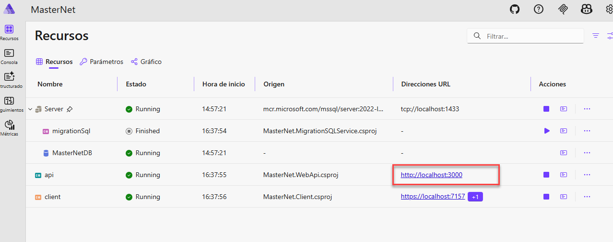
---

## 14. Parámetros y cadenas de conexión

### Variables de parámetro

Se declaran en `AppHost.cs` y se definen en `appsettings.json`:

```csharp
var myParameter = builder.AddParameter("myparameter");
```

```json
"Parameters": {
  "password": "xxxxyyyzzz",
  "myParameter": "Hola mundo"
}
```

Para pasar un parámetro como variable de entorno a un servicio:

```csharp
var api = builder.AddProject<Projects.MasterNet_WebApi>("api")
    .WithReference(db)
    .WaitFor(migration)
    .WithHttpEndpoint(port: 5001)
    .WithReference(migration)
    .WithEnvironment("MY_ENVIROMENT_VARIABLE", myParameter);
```

> **[IMAGEN]**  — Vista del dashboard mostrando variables de entorno
>
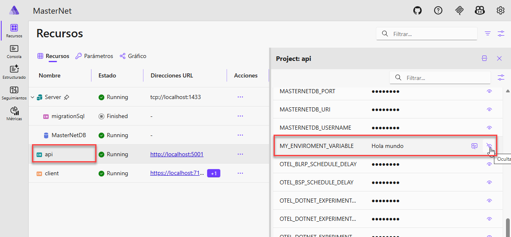

### Cadenas de conexión

Se definen en el `appsettings.json` del `AppHost` y se propagan a los servicios mediante referencia:

```json
"ConnectionStrings": {
  "myConnectionString": "Tu cadena de conexión"
}
```

```csharp
var myConnection = builder.AddConnectionString("myConnectionString");

var api = builder.AddProject<Projects.MasterNet_WebApi>("api")
    .WithReference(db)
    .WaitFor(migration)
    .WithHttpEndpoint(port: 5001)
    .WithReference(migration)
    .WithEnvironment("MY_ENVIROMENT_VARIABLE", myParameter)
    .WithReference(myConnection);
```

> **[IMAGEN]** — Vista del dashboard mostrando cadenas de conexión
>
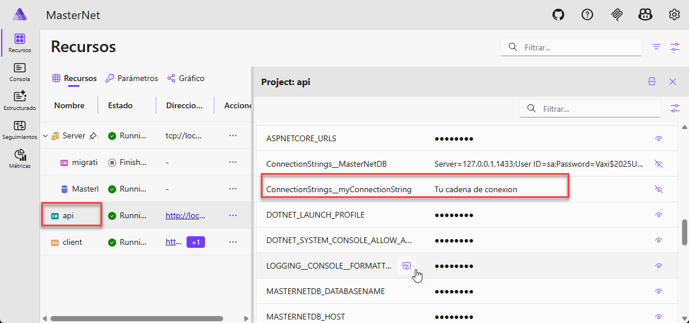

---

## 15. Redis y Web APIs con Aspire

### 15.1. ¿Qué es Redis?

Redis (*Remote Dictionary Server*) es un motor de base de datos en memoria, de código abierto, utilizado principalmente como caché y como almacén clave-valor de alta velocidad. En este proyecto se usa para almacenar y consultar calificaciones de cursos.

### 15.2. Crear el microservicio de ratings

```powershell
dotnet new web -o src/MasterNet.RatingService
dotnet sln add .\src\MasterNet.RatingService

# Referencia a ServiceDefaults (agrega como dependencia de proyecto en VS)
dotnet add package Aspire.StackExchange.Redis --version 13.1.2
```

### 15.3. `Program.cs` del RatingService

```csharp
var builder = WebApplication.CreateBuilder(args);

builder.AddServiceDefaults();
builder.Services.AddCors();
builder.AddRedisClient(connectionName: "cache"); // nombre definido en AppHost
builder.Services.AddSingleton<RatingStore>();

var app = builder.Build();

app.UseCors(x => x.AllowAnyOrigin());
app.MapDefaultEndpoints();
app.Run();
```

### 15.4. `RatingStore.cs`

Clase que encapsula las operaciones de lectura y escritura sobre Redis:

```csharp
public class RatingStore(IConnectionMultiplexer connection)
{
    public void AddRating(string id, int rating)
    {
        var db = connection.GetDatabase();
        db.ListRightPushAsync(id, rating);
    }

    public async Task<int> GetAverageRating(string id)
    {
        var db = connection.GetDatabase();
        var values = await db.ListRangeAsync(id);

        if (values.Length == 0) return 0;

        var promedio = Math.Round(values.Select(x => (int)x).Average(), 0);
        return Convert.ToInt32(promedio);
    }
}
```

### 15.5. Endpoints Minimal API

```csharp
// POST: guarda una calificación en Redis
app.MapPost("/ratings", ([FromBody] RatingRequest request, RatingStore ratingStore) =>
{
    if (string.IsNullOrWhiteSpace(request.Id))
        return Results.BadRequest("Ingrese un curso válido");

    ratingStore.AddRating(request.Id, request.Rating);
    Activity.Current?.SetTag("CourseId", request.Id);
    Activity.Current?.SetTag("rating", request.Rating);

    return Results.Ok();
});

// GET: devuelve la calificación promedio
app.MapGet("/ratings", async ([FromQuery] string id, RatingStore ratingStore) =>
{
    if (string.IsNullOrWhiteSpace(id))
        return Results.BadRequest("Ingrese un curso válido");

    var rating = await ratingStore.GetAverageRating(id);
    Activity.Current?.SetTag("CourseId", id);
    Activity.Current?.SetTag("rating", rating);

    return Results.Ok(rating);
});

public record RatingRequest(string Id, int Rating) { }
```

### 15.6. Conectar el WebAPI con RatingService mediante HttpClient

En `MasterNet.WebApi`, registrar un `HttpClient` tipado que usa Service Discovery para resolver el nombre del servicio:

`RatingServiceHttpClient.cs`
```csharp
public class RatingServiceHttpClient(HttpClient httpClient, ILogger<RatingServiceHttpClient> logger)
    : IRatingServiceClient
{
    public Task<int> GetRating(string id) =>
        httpClient.GetFromJsonAsync<int>($"ratings?id={id}");

    public Task SendRating(string id, int rating)
    {
        logger.LogInformation("Guardando datos en Redis. Curso: {Id}, Rating: {Rating}", id, rating);
        return httpClient.PostAsJsonAsync("ratings", new { Id = id, Rating = rating });
    }
}
```

`Program.cs` del WebAPI:
```csharp
builder.AddServiceDefaults();

// Se usa el alias "ratingservice" definido en AppHost — Service Discovery lo resuelve
builder.Services.AddHttpClient<IRatingServiceClient, RatingServiceHttpClient>(
    x => x.BaseAddress = new Uri("https+http://ratingservice"));
```

> **[IMAGEN]** — Dashboard mostrando el estado de Redis y el RatingService  

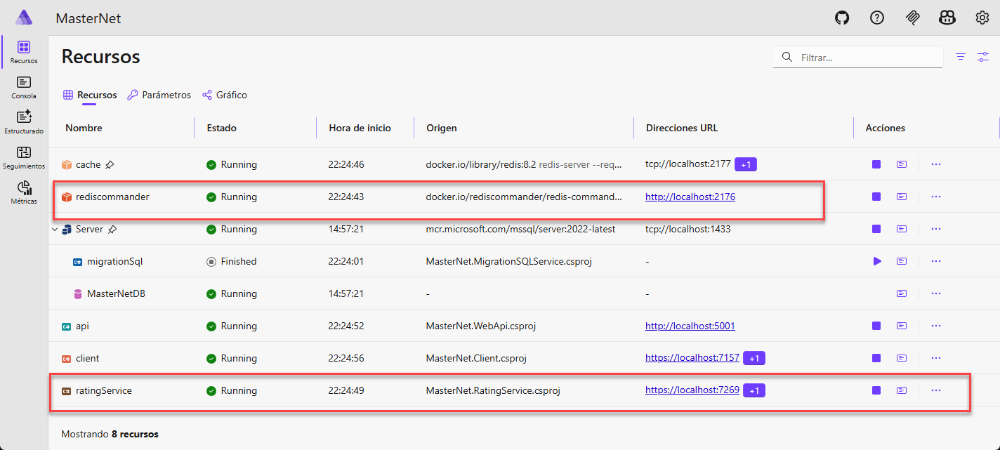


> **[IMAGEN]**  — Diagrama de relaciones entre servicios configurado en Aspire  

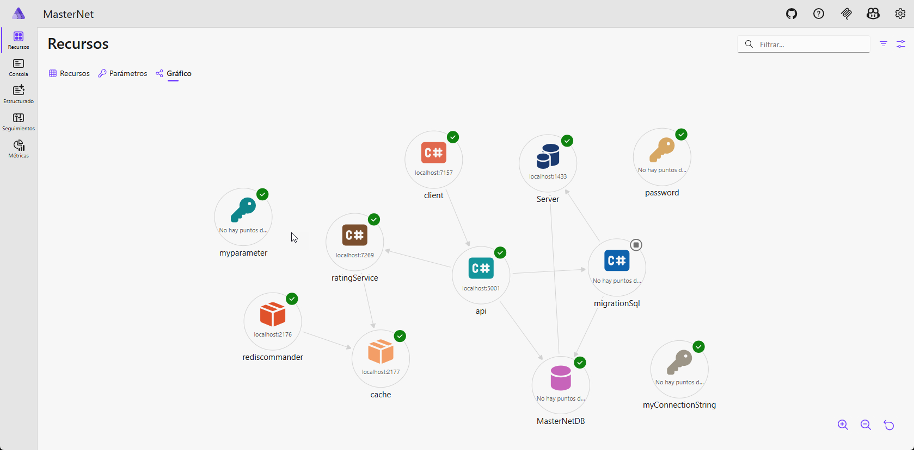


### 15.7. Prueba del endpoint de ratings

Usando el archivo `.http` integrado en Visual Studio:

```http
POST {{MasterNet.WebApi_HostAddress}}/api/ratings
Content-Type: application/json
Accept: application/json

{
  "id": "c1111111-1111-1111-1111-111111111111",
  "rating": 4
}
```

> **[IMAGEN]** — Comunicación WebAPI → RatingService → Redis

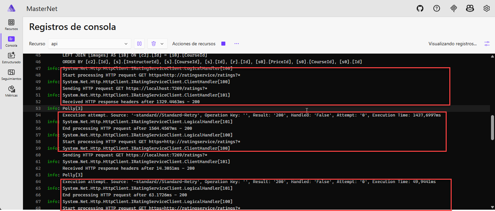

---

## 16. OpenTelemetry: Observabilidad

OpenTelemetry es un estándar abierto para instrumentación de aplicaciones. Aspire lo integra de forma nativa a través de `MasterNet.ServiceDefaults`, exportando datos al dashboard sin necesidad de configuración adicional en cada servicio.

Los tres pilares de observabilidad son:

| Pilar | Descripción |
|---|---|
| **Logs** | Registro de eventos textuales. Útil para seguimiento manual. |
| **Métricas** | Valores numéricos a lo largo del tiempo: latencia, uso de CPU, contadores de operaciones. |
| **Trazas (Traces)** | Recorrido completo de una petición desde su inicio hasta su respuesta, incluyendo todos los servicios involucrados. |

> La ventaja de OpenTelemetry frente a soluciones propietarias es que es un **estándar independiente del proveedor**. Los datos se pueden exportar a Aspire Dashboard, Jaeger, Prometheus, Azure Monitor, etc.

### 16.1. Flujo de logs

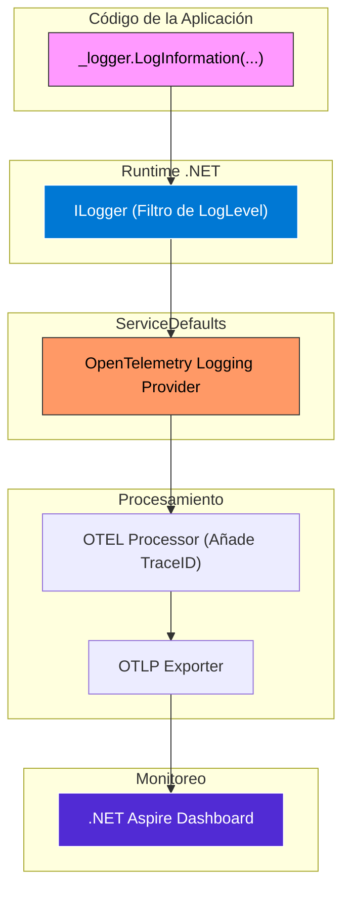

> **Truco:** Pasa los valores como argumentos en lugar de interpolación de strings. Esto hace los logs filtrables en el dashboard:
>
> ```csharp
> // Solo texto — NO filtrable
> logger.LogInformation($"Enviando calificación al curso {id} de {rating}");
>
> // Con argumentos — SÍ filtrable
> logger.LogInformation("Enviando calificación al curso {Id} de {Rating}", id, rating);
> ```

> **[IMAGEN]**  — Vista de logs en el dashboard de Aspire  
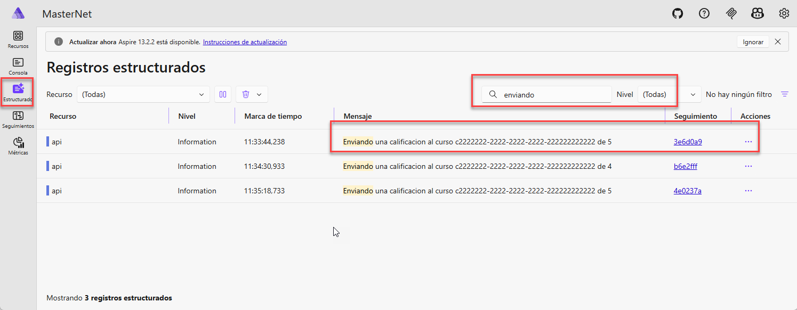
 
> **[IMAGEN]**  — Filtrado de logs por atributos estructurados
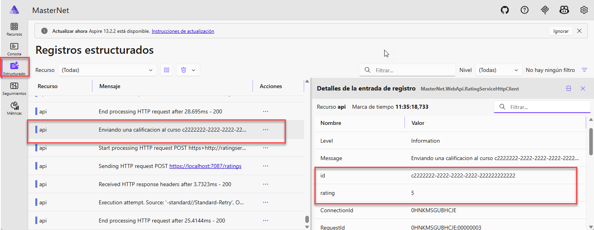

### 16.2. Métricas

Las métricas miden el comportamiento cuantitativo de la aplicación. Se configuran en `MasterNet.ServiceDefaults` y se reportan al dashboard automáticamente.

Ejemplo: contador de ratings enviados en `RatesController.cs`:

```csharp
[AllowAnonymous]
[HttpPost]
public async Task<IActionResult> SendRating([FromBody] SendRatingRequest request)
{
    if (string.IsNullOrWhiteSpace(request.Id) || request.Rating < 1 || request.Rating > 5)
        return BadRequest("El id y el rating son requeridos");

    var meter = new Meter("MasterNet.Course", "1.0");
    var contador = meter.CreateCounter<int>("rating_enviados");

    await _ratingServiceClient.SendRating(request.Id, request.Rating);
    contador.Add(1);

    return Ok();
}
```

Registrar la métrica en `MasterNet.ServiceDefaults/Extensions.cs`:

```csharp
.WithMetrics(metrics =>
{
    metrics.AddAspNetCoreInstrumentation()
           .AddHttpClientInstrumentation()
           .AddRuntimeInstrumentation()
           .AddMeter("MasterNet.Course"); // nombre del Meter definido en el código
})
```

> **[IMAGEN]**  — Panel de métricas en el dashboard de Aspire

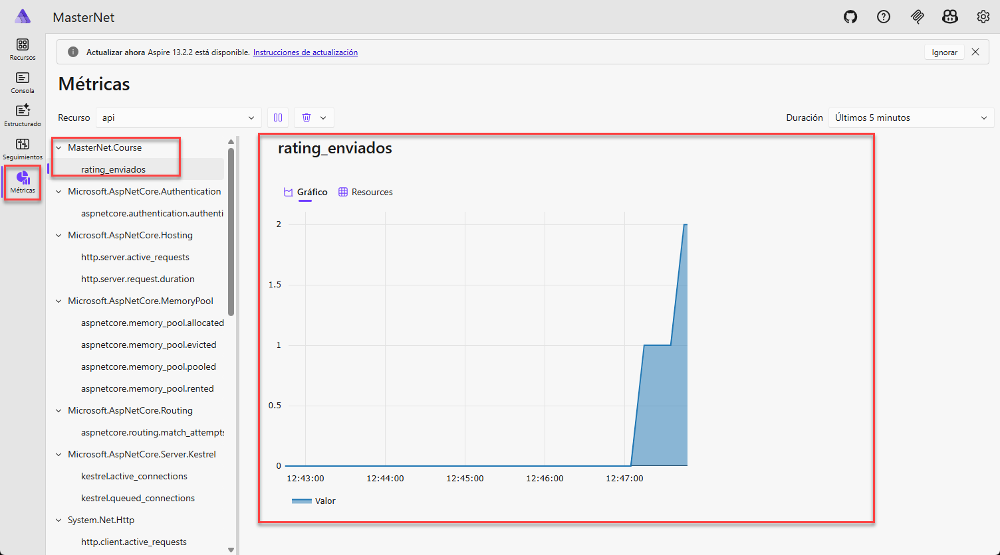

### 16.3. Trazas y Spans

Una **traza** representa el recorrido completo de una operación de principio a fin. Está compuesta por **spans**, donde cada span representa una operación individual (llamada HTTP, consulta SQL, acceso a Redis, etc.).

[IMAGEN] — Visualización de una traza distribuida en el Dashboard
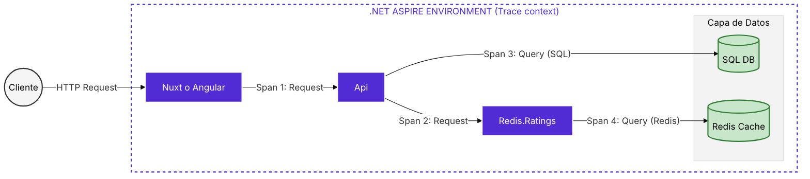


Osea lo unico que te muestra el trace es el recorrigo de todo tu proceso.
> **[IMAGEN]**  — Vista general de trazas en el dashboard  
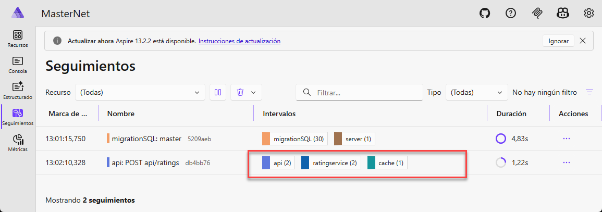


Cada linea de la imagens representan un **Span**

> **[IMAGEN]**  — Detalle de spans dentro de una traza  
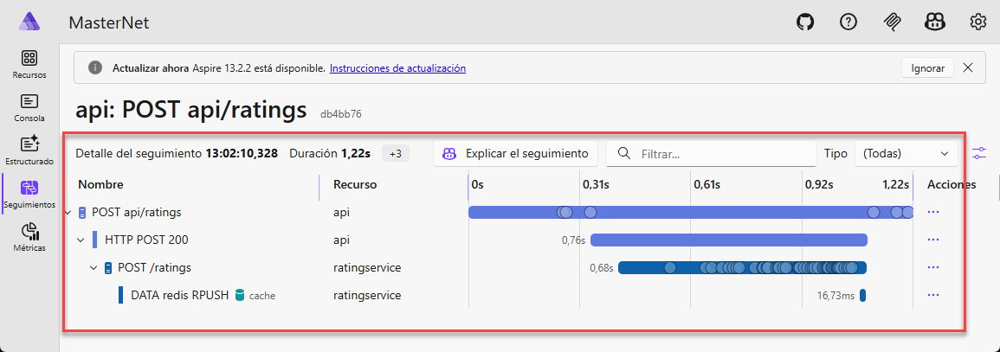

#### Crear un span personalizado

En `MasterNet.Application/GetCoursesQuery.cs`:

```csharp
private static readonly ActivitySource _activitySource = new("MasterNet.Course2");

// Dentro del handler:
using (var activity = _activitySource.StartActivity("Trae las calificaciones"))
{
    for (int i = 0; i < pagination.Items.Count; i++)
    {
        var course = pagination.Items[i];
        var rating = await _ratingServiceClient.GetRating(course.Id.ToString());
        pagination.Items[i] = course with { Score = rating };
    }
}
```

Registrar la fuente del span en `ServiceDefaults/Extensions.cs`:

```csharp
.WithTracing(tracing =>
{
    tracing.AddSource(builder.Environment.ApplicationName)
           .AddSource("MasterNet.Course2") // nombre del ActivitySource
           .AddAspNetCoreInstrumentation(t =>
               t.Filter = context =>
                   !context.Request.Path.StartsWithSegments(HealthEndpointPath) &&
                   !context.Request.Path.StartsWithSegments(AlivenessEndpointPath)
           )
           .AddHttpClientInstrumentation()
           .AddSqlClientInstrumentation(); // requiere paquete adicional
})
```

> **[IMAGEN]**  — Trazas de llamadas HTTP a servicios externos  
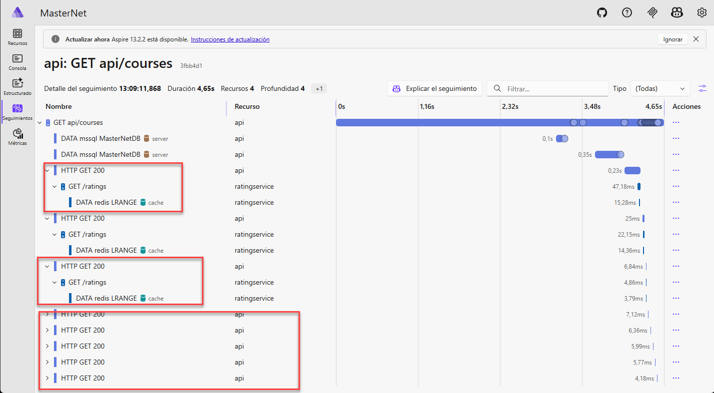

#### Agregar atributos y eventos a un span

```csharp
// Atributos (útiles para filtrar en el dashboard)
Activity.Current?.SetTag("CourseId", request.Id);
Activity.Current?.SetTag("rating", request.Rating);

// Eventos (registro de momentos específicos dentro del span)
Activity.Current?.AddEvent(new ActivityEvent("Evento post"));
```
> **[IMAGEN]**  — Span personalizado visible en el dashboard
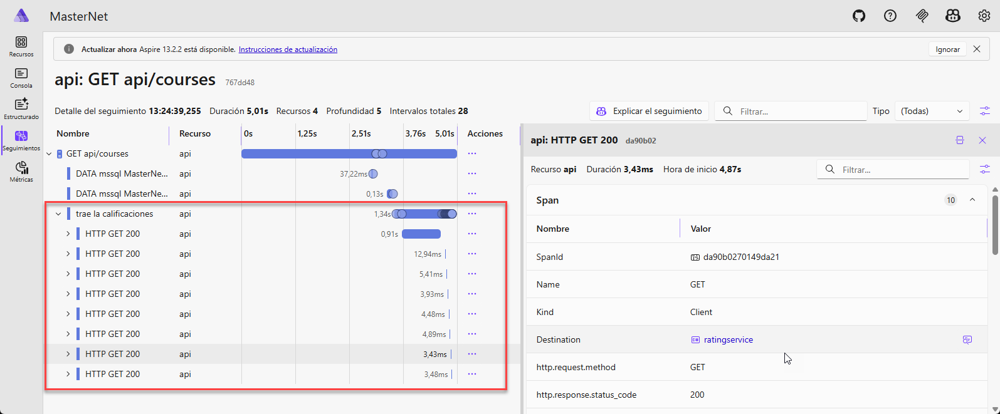

#### Habilitar trazas de SQL (Entity Framework)

Agregar el paquete al `MasterNet.ServiceDefaults`:

```xml
<PackageReference Include="OpenTelemetry.Instrumentation.SqlClient" Version="1.9.0" />
```

Y en `Extensions.cs` incluir `.AddSqlClientInstrumentation()` dentro del bloque `.WithTracing(...)` como se muestra arriba. Esto expone en el dashboard todas las queries ejecutadas por Entity Framework.

---

## 17. Health Checks

Los health checks exponen endpoints que permiten conocer el estado de los servicios. Están configurados en `MasterNet.ServiceDefaults` y solo se activan en entornos de desarrollo por seguridad.

| Endpoint | Propósito |
|---|---|
| `/health` | Verifica que todos los checks pasen (readiness) |
| `/alive` | Verifica solo los checks con tag `"live"` (liveness) |

Configuración en `Extensions.cs`:

```csharp
public static TBuilder AddDefaultHealthChecks<TBuilder>(this TBuilder builder)
    where TBuilder : IHostApplicationBuilder
{
    builder.Services.AddHealthChecks()
        .AddCheck("self", () => HealthCheckResult.Healthy(), ["live"]);
    return builder;
}

public static WebApplication MapDefaultEndpoints(this WebApplication app)
{
    if (app.Environment.IsDevelopment())
    {
        app.MapHealthChecks("/health");
        app.MapHealthChecks("/alive", new HealthCheckOptions
        {
            Predicate = r => r.Tags.Contains("live")
        });
    }
    return app;
}
```

Cada servicio llama a `app.MapDefaultEndpoints()` en su `Program.cs` para exponer estos endpoints.

---

## Referencia rápida de comandos

```powershell
# Levantar la solución completa
dotnet run --project .\src\MasterNet.AppHost\

# Levantar solo Docker (SQL Server sin Aspire)
docker compose up -d

# Reiniciar red de Docker (si hay conflictos de puertos)
net stop winnat && net start winnat

# Regenerar certificados HTTPS de desarrollo
dotnet dev-certs https --clean && dotnet dev-certs https --trust

# Crear nueva migración EF Core (desde el proyecto Persistence)
dotnet ef migrations add <NombreMigracion> --project .\src\MasterNet.Persistence\ --startup-project .\src\MasterNet.WebApi\
```

---

> Este documento es una guía técnica de referencia del proyecto **MasterNet** construido sobre **.NET Aspire 9/10**.  

